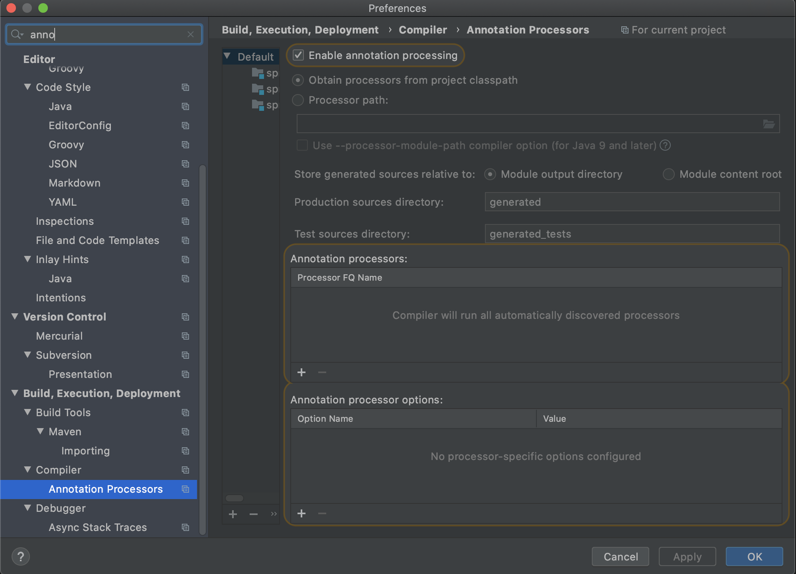

# ch2.스프링 부트에서 테스트 코드를 작성하자
> ## 롬복 소개 및 설치하기
- Getter, Setter, 기본생성자, toString 등을 어노테이션으로 자동 생성
- 이클립스의 경우엔 설치가 번거롭지만, 인텔리제이에선 플러그인을 통해 쉽게 설정이 가능
----
1. build.gradle 롬복 의존성(라이브러리) 추가
    > build.gradle
    ```gradle
    compile('org.projectlombok:lombok')
    ```
2. 롬복 플러그인 설치
    - 액션 검색창 열기
        - 윈도우 단축키 : Ctrl + Shift + A
        - 맥 단축키 : Command + Shift + A
    - plugins 검색
    - 해당 액션 선택 후 엔터버튼
    - Marketplace 탭에서 lombok 검색하여 설치
    - 설치 후 반드시 인텔리제이 재시작
3. Enable annotation processing 체크

    
<font color="red" size="5"> - 롬복 플러그인 설치를 제외한 build.gradle 추가와 Enable annotation processing 체크설정은 프로젝트마다 진행해야 함!!!</font>

------
> ## Hello Controller lombok으로 리팩토링

> HelloResponseDto.java
```java
package com.tongyo.book.springboot.web.dto;

import lombok.Getter;
import lombok.RequiredArgsConstructor;

@Getter // 선언된 모든 필드의 get 메소드를 생성해줌
@RequiredArgsConstructor // 선언된 모든 final 필드가 포함된 생성자를 생성, final이 없는 필드는 생성자에 포함되지 않음
public class HelloResponseDto {
    private final String name;
    private final int amount;
}
```
> HelloResponseDtoTest.java
```java
package com.tongyo.book.springboot.web.dto;

import org.junit.Test;
import static org.assertj.core.api.Assertions.assertThat;

public class HelloResponseDtoTest {
    @Test
    public void 롬복_기능_테스트(){
        //given
        String name = "test";
        int amount = 1000;

        //when
        HelloResponseDto dto = new HelloResponseDto(name, amount);

        //then
        assertThat(dto.getName()).isEqualTo(name);
        assertThat(dto.getAmount()).isEqualTo(amount);
        /***** assertThat ******
         * assert라는 테스트 검증 라이브러리의 검증 메소드
         * 검증하고 싶은 대상의 메소드 인자를 받음
         * 메소드 체이닝이 지원되어 isEqualTo와 같이 메소드를 이어서 사용할 수 있음

         * Junit의 기본 assertThat 아닌 assertj의 assertThat를 사용
         * assertj 역시 Junit에서 자동으로 라이브러리에 등록 해줌
         * Junit과 비교하여 assertj의 장점은 CoreMatchers와 달리 추가적으로 라이브러리가 필요하지 않으며, 자동완성이 좀 더 확실하게 지원됨
         */
    }
}
```
- ## 만약 실행이 안된다면 그래들 버젼을 확인해야함. (gradle-wrapper.properties 파일 확인)
    - 4버젼에서 실행됨. 4버젼으로 다운그레이드 하고싶다면 인텔리제이 터미널에서 해당 명령어 사용
    ```terminal
    ./gradlew wrapper --gradle-version 4.10.2
    ```
> HelloController.java
```java
@GetMapping("/hello/dto")
public HelloResponseDto helloDto(@RequestParam("name") String name, @RequestParam("amount") int amount){
    return new HelloResponseDto(name, amount);
}
```
> HelloControllerTest.java
```java
@Test
public void helloDto가_리턴된다() throws Exception{
    String name = "hello";
    int amount = 1000;

    // param 사용시 String 값만 허용되기때문에 숫자나 날짜 등의 데이터를 등록할 때는 문자열로 변경 필요
    mvc.perform(get("/hello/dto").param("name", name).param("amount", String.valueOf(amount)))
            .andExpect(status().isOk())
            // jsonPath는 Json 응답값을 필드별로 검증할 수 있는 메소드
            // $를 기준으로 필드명을 명시
            // 여기서는 name과 amount를 검증하니 $.name, $.amount로 검증
            .andExpect(jsonPath("$.name", is(name)))
            .andExpect(jsonPath("$.amount", is(amount)));
}
```